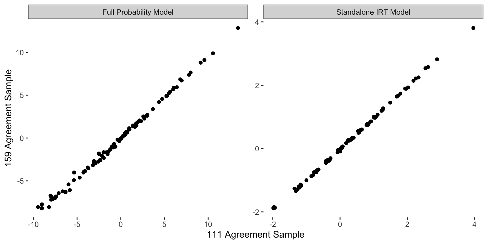

# Peace Agreement Strength Estimates

This directory contains the posterior means and 95% credible intervals for the
strength of each peace agreement in the article. In the article, we limit our
sample to agreements signed during active conflict-years, which results in a
sample of 111 agreements between 1975 and 2005. To facilitate the use of the
estimates by other researchers, we've reestimated the model after including
agreements signed in inactive conflict-years. This expanded sample includes
159 agreements between 1975 and 2005.

# The Data

The estimates are contained in two files. In each file, the estimates from the
article sample of 111 active conflict-year agreements are denoted by the `_rstr`
suffix, while the expanded estimates from the sample of 159 activity agnostic
agreements are denoted by the `_full` suffix.

- `full prob.csv` which contains estimates from the full probability model
presented in the article
- `irt.csv` which contains estimates from the standalone IRT model presented
in the supplemental information

If you use the full probability model estimates, you should not include any of
the variables in Table 1 of the article as they influence the estimates.

Strength estimates for the 111 agreements shared between both samples correlate
at greater than 0.99 for both the full probability and standalone IRT models.



# Full Posteriors

You can download the full posterior distributions for the 111 agreement sample
presented in the article from the
[replication archive](https://doi.org/10.7910/DVN/VUY8UI) in the
`directories.tar.gz` archive. If you wish to obtain full posteriors for the
expanded 159 agreement sample, you can use the `03 Data Manipulation Full Sample.R`
script in this directory. This script adds the following code to the end of line
33 in the regular version of `03 Data Manipulation.R`:

```r
%>%
group_by(ID) %>% 
tidyr::complete(YEAR = seq(min(YEAR), max(YEAR) + 50, by = 1)) %>%
tidyr::fill(Type:COWcode, .direction = 'down')
```

These extra lines fill in the `CumInt`, `Inc`, and `intervention_acd` variables
for inactive conflict-years and after the termination of a conflict. Running this
modified version requires the `tidyr` package, but the rest of the `.R` and
`.Rnw` files should not require any modification.